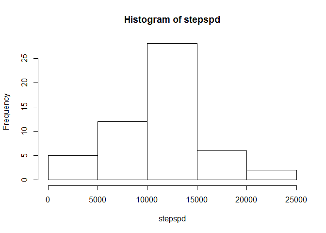
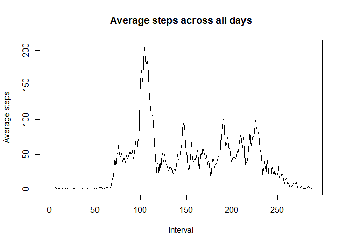
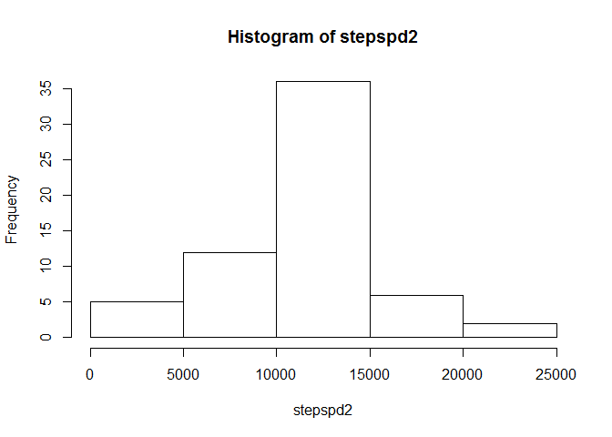
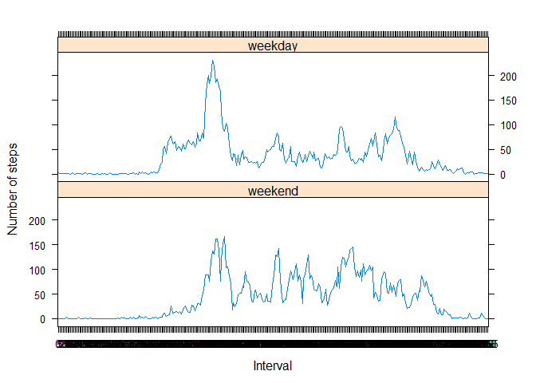

# Reproducible Research: Peer Assessment 1


## Loading and preprocessing the data


```r
data <- read.csv(unz("activity.zip","activity.csv"),header=TRUE, stringsAsFactors = FALSE)
str(data)
```

```
## 'data.frame':	17568 obs. of  3 variables:
##  $ steps   : int  NA NA NA NA NA NA NA NA NA NA ...
##  $ date    : chr  "2012-10-01" "2012-10-01" "2012-10-01" "2012-10-01" ...
##  $ interval: int  0 5 10 15 20 25 30 35 40 45 ...
```

```r
data$date <- as.Date(data$date,format="%Y-%m-%d")
data$interval <- as.factor(data$interval)
str(data)
```

```
## 'data.frame':	17568 obs. of  3 variables:
##  $ steps   : int  NA NA NA NA NA NA NA NA NA NA ...
##  $ date    : Date, format: "2012-10-01" "2012-10-01" ...
##  $ interval: Factor w/ 288 levels "0","5","10","15",..: 1 2 3 4 5 6 7 8 9 10 ...
```

## What is mean total number of steps taken per day? - ignore missing values
Calculate the total number of steps taken per day
Make a histogram of the total number of steps taken each day
Mean and median of the total number of steps taken per day


```r
stepspd <- tapply(data$steps,data$date,sum)
hist(stepspd)
```

 

```r
summary(stepspd)
```

```
##    Min. 1st Qu.  Median    Mean 3rd Qu.    Max.    NA's 
##      41    8841   10760   10770   13290   21190       8
```

```r
means <- mean(stepspd, na.rm = T)
medians <- median(stepspd, na.rm = T)
```

The mean of total number of steps is 1.0766189\times 10^{4} and 
median is 10765.

## What is the average daily activity pattern?

Make a time series plot (i.e. type = "l") of the 5-minute interval (x-axis) and the average number of steps taken, averaged across all days (y-axis)
Which 5-minute interval, on average across all the days in the dataset, contains the maximum number of steps?


```r
p <- tapply(data$steps,data$interval,mean,na.rm = T)
plot(p, type = "l", main = "Average steps across all days", 
     xlab = "Interval", ylab = "Average steps")
```

 

```r
maxint <- row.names(p)[which.max(p)]
```

The 5-minute interval which contains the maximum number of steps is 
the interval: 835

## Imputing missing values


Impute missing values
<http://www.mail-archive.com/r-help@r-project.org/msg58289.html>


```r
narows <- nrow(data)-nrow(data[complete.cases(data),])

stepsna <- is.na(data$steps)
datena <- is.na(data$date)
intna <- is.na(data$interval)
sum(datena) # no missing values in date
```

```
## [1] 0
```

```r
sum(intna) # no missing values in interval
```

```
## [1] 0
```

```r
library(plyr)
impute <- function(x, fun) {
  missing <- is.na(x)
  replace(x, missing, fun(x[!missing]))
}
# impute missing in steps as mean for a day
data2 <- ddply(data, ~ interval, transform, steps = impute(steps, mean))
sum(is.na(data$steps))
```

```
## [1] 2304
```

```r
stepspd2 <- tapply(data2$steps,data2$date,sum)
hist(stepspd2)
```

 

```r
summary(stepspd2)
```

```
##    Min. 1st Qu.  Median    Mean 3rd Qu.    Max. 
##      41    9819   10770   10770   12810   21190
```

```r
means2 <- mean(stepspd2, na.rm = T)
medians2 <- median(stepspd2, na.rm = T)
```

The total number of rows with missing values is: 2304

The mean of total number of steps is 1.0766189\times 10^{4} and 
median is 1.0766189\times 10^{4}.

As a result of imputing missing values the median has incrased but the mean remains the same.

## Are there differences in activity patterns between weekdays and weekends?
Create a new factor variable in the dataset with two levels - "weekday" and "weekend" indicating whether a given date is a weekday or weekend day.


```r
#create a vector of weekdays
weekdays1 <- c('Monday', 'Tuesday', 'Wednesday', 'Thursday', 'Friday')
#Use `%in%` and `weekdays` to create a logical vector
#convert to `factor` and specify the `levels/labels`
data2$wDay <- factor((weekdays(data2$date) %in% weekdays1), 
         levels=c(FALSE, TRUE), labels=c('weekend', 'weekday'))
```
Make a panel plot containing a time series plot (i.e. type = "l") of the 5-minute interval (x-axis) and the average number of steps taken, averaged across all weekday days or weekend days (y-axis)


```r
p <- aggregate(steps ~ wDay+interval, data= data2, mean)
library(lattice)
xyplot(steps~interval|wDay, type = "l", data = p, 
     xlab = "Interval", ylab = "Number of steps",layout=c(1,2))
```

 
